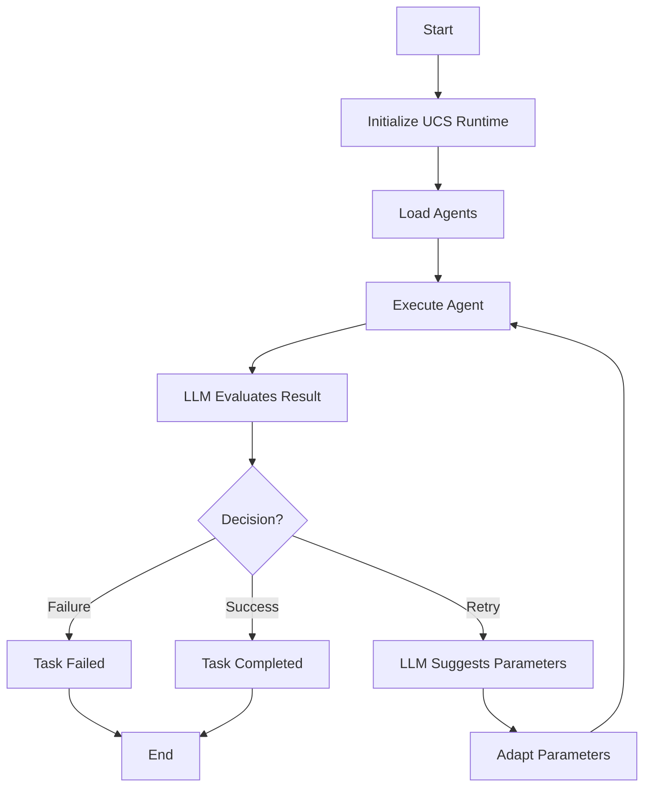

# LLM-Enhanced Orchestration Demo

This project demonstrates an LLM-enhanced orchestration system that can adaptively retry failed tasks and adjust parameters based on LLM evaluations. It also includes a chat interface that allows users to check website status through natural language commands.

## Features

- **Adaptive Orchestration**: The system uses an LLM to evaluate the results of agent executions and decide on the next steps.
- **Retry Logic**: If an agent fails, the system can retry the task with different parameters suggested by the LLM.
- **Parameter Adaptation**: The system can adjust agent parameters based on LLM suggestions to improve the chances of success.
- **Proper Error Handling**: The system correctly handles DNS lookup failures for non-existent domains.
- **Robust LLM Response Parsing**: The system can handle various formats of LLM responses and extract structured data.
- **Website Checking via Chat Interface**: Users can check website status through natural language commands like "check website <url>" in the chat interface.
- **Intelligent Error Diagnosis**: When website checks fail, the system provides intelligent diagnosis and resolution suggestions.

## Prerequisites

- Python 3.8 or higher
- Ollama running on `http://192.168.0.230:11434` (or update the settings in `.env` and `src/config/settings.py`)
- Qwen3:8b model installed in Ollama (or update the model name in settings)

## Installation

1. Install the required Python packages:
   ```bash
   pip install -r requirements.txt
   ```

2. Make sure Ollama is running with the Qwen3:8b model:
   ```bash
   ollama run qwen3:8b
   ```

## Configuration

The system can be configured through:
1. Environment variables in the `.env` file
2. Direct modification of `src/config/settings.py`

Key configuration options:
- `LLM_MODEL`: The model to use (default: `ollama_chat/qwen3:8b`)
- `LLM_BASE_URL`: The Ollama server URL (default: `http://192.168.0.230:11434`)
- `LLM_API_KEY`: API key if required (default: `ollama`)

## How It Works

1. The `demo_llm_orchestration.py` script initializes the UCS runtime and loads the agents.
2. It then demonstrates the adaptive orchestration loop:
   - An agent is executed.
   - The LLM evaluates the result and decides whether to retry, adjust parameters, or consider the task successful.
   - If a retry is needed, the LLM can suggest new parameters to use for the retry.
3. The script also demonstrates a failure and retry scenario using a domain that is expected to fail (`test.cogniscient.io`).

## Key Components

- **UCSRuntime**: Manages the loading and execution of agents, and maintains their configurations.
- **LLMOrchestrator**: Orchestrates agent executions and uses an LLM to evaluate results and decide on next steps.
- **SampleAgentA**: A sample agent that performs DNS lookups using a configurable DNS server.
- **SampleAgentB**: Another sample agent that performs website checks.

## Orchestration Flow



## Running the Demo

To run the demo, execute the following command:

```bash
python3 demo_llm_orchestration.py
```

This will show the adaptive orchestration in action, including:
1. A successful DNS lookup for a valid domain
2. A failed DNS lookup for a non-existent domain (`test.cogniscient.io`) with retry attempts
3. Parameter adaptation demonstration
4. Chat interface demonstration
5. Website checking functionality demonstration

The demo showcases how the system can handle both successful and failed agent executions, and how it uses LLM evaluations to make decisions about retrying tasks or adjusting parameters. The system correctly identifies when a task cannot be completed (like a non-existent domain) and stops retrying after a few attempts.

## Website Checking via Chat Interface

Users can check website status through natural language commands in the chat interface:

1. **Command Format**: Users can type commands like "check website <url>", "test site <url>", or "verify url <url>"
2. **Successful Checks**: For accessible websites, the system responds with status information
3. **Error Diagnosis**: For inaccessible websites, the system provides intelligent diagnosis and resolution suggestions
4. **Integration**: The feature integrates seamlessly with the existing chat interface and LLM orchestrator

Example commands:
- `check website https://example.com`
- `test site http://google.com`
- `verify url https://github.com`

The system uses SampleAgentB to perform the actual website checks and the LLM orchestrator to provide intelligent analysis of results.

## Troubleshooting

If you encounter issues with the LLM service:

1. **Model Name Format**: Ensure the model name uses the correct format for Ollama (`ollama_chat/model_name`)
2. **Base URL**: Make sure the base URL doesn't have `/v1` appended for Ollama
3. **Environment Variables**: If you have environment variables set, they may override the settings in `.env`. You can unset them with:
   ```bash
   unset LLM_MODEL LLM_BASE_URL
   ```
4. **Ollama Connection**: Ensure Ollama is running and accessible at the specified URL